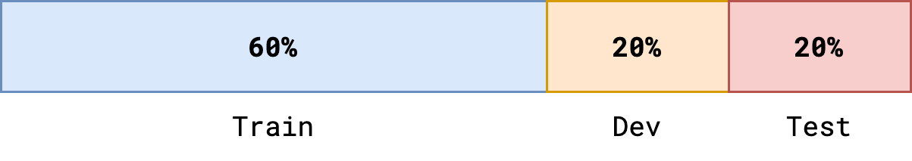

# Deep Learning Specialisation

## Course 1: Neural Networks and Deep Learning

- [Handwritten Notes 📕]()

## Course 2: Improving Deep Neural Networks: Hyperparameter Tuning, Regularization and Optimization

On this page you will find summary notes for key concepts covered in the second course of Coursera's [Deep Learning Specialisation](https://www.coursera.org/learn/deep-neural-network?specialization=deep-learning){:target="_blank"} by Andrew Ng. The course coveres Hyperparameter Tuning, Regularisation and Optimisation of Deep Neural Networks.

!!! note
    This page acts as a handy reference (cheatsheet) and is not intended to provide in-depth explanations. However, code snippets and links to external resources will be provided.

<!-- Week 1 -->
---

## Train/Dev/Test Sets

Applied machine learning is highly iterative. We may need to try out many different models, with each having a large number of possible hyperparameter settings. Given a dataset, we generally split the data into 3 subsets:

<div align="center">
    
</div>
<!-- <div align="center">
    
</div> -->
- **Training set**: used to learn the parameters of a model.
- **Development/validation set**: used to rank models following training (tuning hyperparameter settings) so we can choose the best performing model on this set.
- **Test set**: used to evaluate the performance of the chosen model and give an unbiased estimate of performance. This helps us assess how well our trained model generalises to unseen data.

To create these sets, we can utilise scikit-learn's [`train_test_split`](https://scikit-learn.org/stable/modules/generated/sklearn.model_selection.train_test_split.html){:target="_blank"} function:

=== "Basic"

    ```python
    from sklearn.model_selection import train_test_split

    X_train, X_test, y_train, y_test = train_test_split(
        X, y, test_size=0.2, random_state=1)
    X_train, X_val, y_train, y_val = train_test_split(
        X_train, y_train, test_size=0.25, random_state=1)
    ```

=== "Helper Function"

    ``` c++
    #include <iostream>

    int main(void) {
      std::cout << "Hello world!" << std::endl;
      return 0;
    }
    ```

??? Tips tip
    
    - Depending on the size of the dataset, a ratio of 60% train/20% dev/20% test can be used, although this can be adjusted accordingly (for very large datasets, a ratio of 98% train/1% dev/1% test would allow the majority of the data to be learned by a model during training, and would allow the dev and test sets to contain enough data to be evaluated on).
    - Shuffle the data randomly to prevent biased results.
    - Not having a dev set would make it difficult to know whether the choice of parameters or choice of model is preventing you from improving the accuracy of your model.
    - If no hyperparameter tuning is required, you may not require a dev set.
    - Ensure the distribution of the dev/test sets match the distribution of the future data (otherwise the model may not work!)
    - Be careful of a mismatched train/test distribution.
    - Forget the test data exists until the very end for a final evaluation and do not tune the model further!

!!! References quote

    - Everything You Need To Know About Train/Dev/Test Split — What, How and Why (<https://snji-khjuria.medium.com/everything-you-need-to-know-about-train-dev-test-split-what-how-and-why-6ca17ea6f35>{:target="_blank"})
    - Improving Deep Neural Networks: Hyperparameter Tuning, Regularization and Optimization (<https://www.coursera.org/learn/deep-neural-network?specialization=deep-learning>{:target="_blank"})

<!-- --- -->

<!-- ## Bias and Variance

High bias: underfitting
High variance: overfitting

Bias/Variance tradeoff

| Set       | Error              |
| --------- | ---------------------- |
| Train set | 1%  | 14% | 14% | 0.5% |
| Dev set   | 10% | 14% | 28% | 1%   | -->